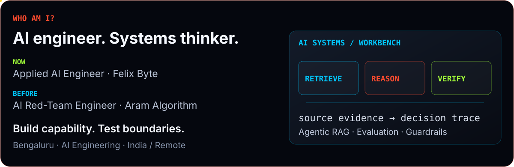
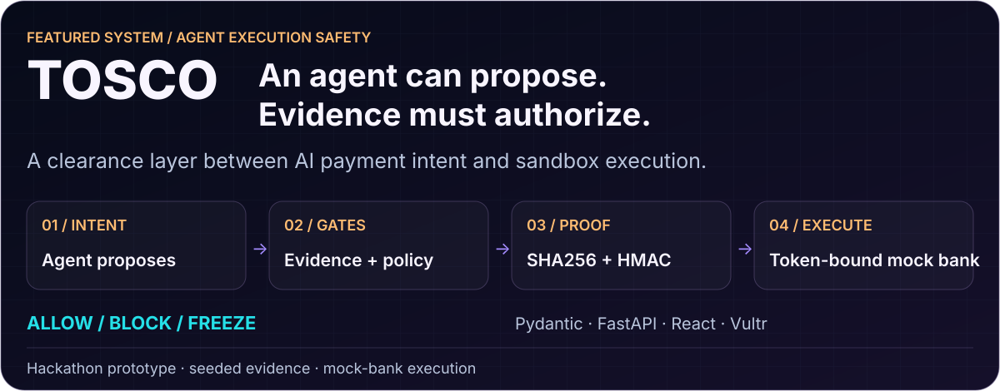
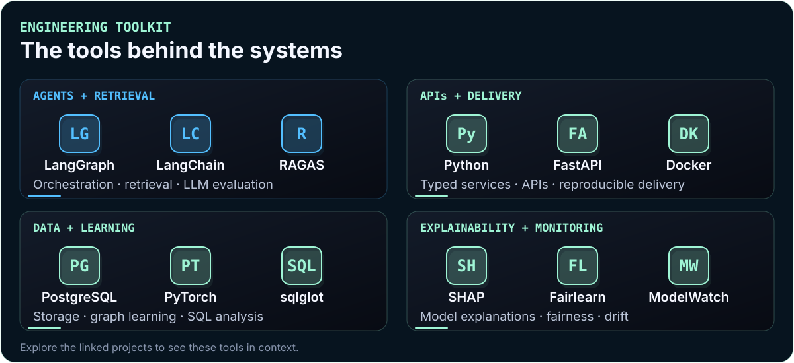
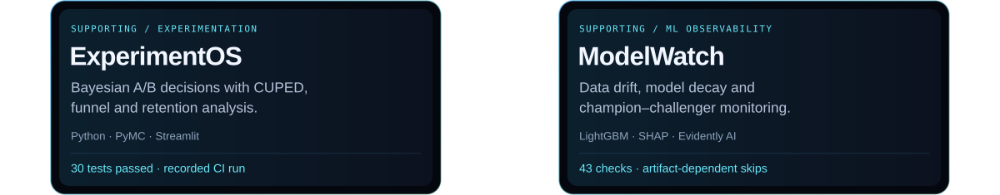
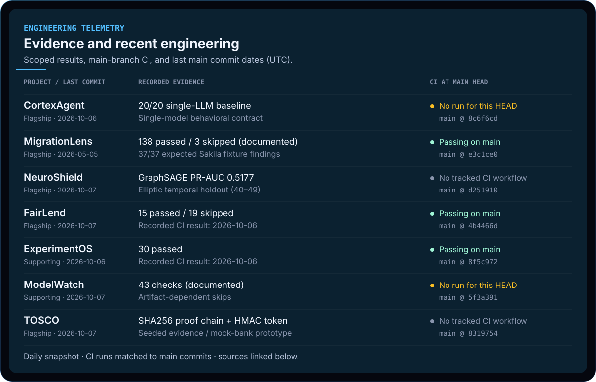

# Yaswanth Kumar Akkireddy

**AI Engineer · Generative AI · Agentic AI · Retrieval-Augmented Generation (RAG)**

LLM Evaluation · AI Reliability · AI Security & Red Teaming

<picture>
  <source media="(max-width: 600px)" srcset="assets/hero-mobile.svg">
  
</picture>

[LinkedIn](https://www.linkedin.com/in/yaswanthakkireddy) · [GitHub](https://github.com/yaswanthakkireddy) · [Email](mailto:yaswanthkumarakkireddy@gmail.com)

**Explore:** [Agentic RAG → CortexAgent](https://github.com/yaswanthakkireddy/cortexagent) · [Agent execution safety → TOSCO](https://github.com/yaswanthakkireddy/TOSCO) · [SQL migration analysis → MigrationLens](https://github.com/yaswanthakkireddy/MigrationLens)

## Engineering Profile

<picture>
  <source media="(max-width: 600px)" srcset="assets/about-mobile.svg">
  
</picture>

Applied AI Engineer at **Felix Byte Technologies** · Previously AI Red-Team Engineer at **Aram Algorithm**  
Bengaluru, India · Open to AI Engineering roles across India / Remote

I build **Generative AI and agentic systems** with Python, LangGraph and FastAPI: source-grounded **RAG**, multi-agent orchestration, **LLM evaluation**, deterministic guardrails and auditable tool execution. My AI red-teaming experience informs how I test failures and define safety boundaries.

**Engineering focus:** retrieval quality · agent tool safety · reproducible evaluation · explainability · observability  
**Core tools:** Python · LangGraph · LangChain · FastAPI · Docker · PostgreSQL · RAGAS · PyTorch

<picture>
  <source media="(max-width: 600px)" srcset="assets/system-mobile.svg">
  
</picture>

## Flagship Systems

<a href="https://github.com/yaswanthakkireddy/TOSCO">
<picture>
  <source media="(max-width: 600px)" srcset="assets/projects/tosco-mobile.svg">
  
</picture>
</a>

**[TOSCO](https://github.com/yaswanthakkireddy/TOSCO)** — an agent proposes a payment; typed evidence and deterministic gates decide **ALLOW / BLOCK / FREEZE**. A hash-chained proof packet and HMAC clearance token bind the decision to sandbox execution. **FastAPI · Pydantic · React · Vultr.**

*RAISE Summit hackathon prototype: seeded evidence, simulated enterprise signals and a mock bank.*

<b>See TOSCO’s clearance console and technical evidence</b>

[Architecture](https://github.com/yaswanthakkireddy/TOSCO/blob/main/docs/ARCHITECTURE.md) · [Security boundaries](https://github.com/yaswanthakkireddy/TOSCO/blob/main/docs/SECURITY_NOTES.md)

<picture>
  <source media="(max-width: 600px)" srcset="assets/projects/core-mobile.svg">
  
</picture>

**[CortexAgent](https://github.com/yaswanthakkireddy/cortexagent)** — SEC 10-K research with LangGraph, hybrid retrieval, reranking, critic-gated revision and RAGAS evaluation.

**[MigrationLens](https://github.com/yaswanthakkireddy/MigrationLens)** — MySQL-to-PostgreSQL migration risk analysis with deterministic rules, sqlglot and SARIF output.

**[NeuroShield](https://github.com/yaswanthakkireddy/NeuroShield)** — transaction-graph learning with PyTorch Geometric, temporal evaluation and explainability.

**[FairLend](https://github.com/yaswanthakkireddy/fairlend)** — credit-risk modelling with LightGBM, SHAP explanations and Fairlearn mitigation. Research benchmark results are separate from the synthetic demo.

## Reliability-first AI Engineering

Capability is only half the system.

I care about what happens when retrieval is weak, a model hallucinates, or an agent attempts an unsafe tool action. My work combines AI engineering with structured evaluation, guardrails, auditability and adversarial testing, informed by my experience red teaming LLMs.

- **Evaluate:** define the task, dataset and behavioral contract before interpreting a score.
- **Constrain:** use deterministic checks and validate model output before accepting it.
- **Trace:** retain evidence that helps explain failures and reproduce decisions.

## Engineering Toolkit

<picture>
  <source media="(max-width: 600px)" srcset="assets/toolkit-mobile.svg">
  
</picture>

**Agents & retrieval:** LangGraph · LangChain · RAGAS  
**APIs & delivery:** Python · FastAPI · Docker  
**Data & learning:** PostgreSQL · PyTorch · sqlglot  
**Explainability & monitoring:** SHAP · Fairlearn · ModelWatch

## Supporting Systems

<picture>
  <source media="(max-width: 600px)" srcset="assets/projects/supporting-mobile.svg">
  
</picture>

**[ExperimentOS](https://github.com/yaswanthakkireddy/ExperimentOS)** — Bayesian A/B testing with CUPED variance reduction, funnel and retention analysis.

**[ModelWatch](https://github.com/yaswanthakkireddy/modelwatch)** — drift and model-decay monitoring with PSI/KS, SHAP drift and a champion–challenger loop.

## Engineering Telemetry

<picture>
  <source media="(max-width: 600px)" srcset="assets/activity-mobile.svg">
  
</picture>

Scheduled daily from GitHub; the snapshot changes only when its underlying evidence, activity or CI state changes. Repository activity is not a productivity score, and CI success does not establish model safety.

<b>Evidence, datasets and methodology behind the numbers</b>

### Evidence behind the numbers

| System | Evidence and scope |
| :--- | :--- |
| TOSCO | [Typed evidence and deterministic gates](https://github.com/yaswanthakkireddy/TOSCO/blob/main/docs/ARCHITECTURE.md), SHA256 proof chaining and HMAC clearance tokens. [Sandbox scope](https://github.com/yaswanthakkireddy/TOSCO/blob/main/docs/SECURITY_NOTES.md): seeded evidence and mock-bank execution. |
| CortexAgent | **20/20 prompts** in the [single-model behavioral-contract baseline](https://github.com/yaswanthakkireddy/cortexagent/blob/main/evaluation/red_team_raw_baseline.json). [Methodology](https://github.com/yaswanthakkireddy/cortexagent/blob/main/docs/06_safety.md) distinguishes this from the full orchestrator. |
| MigrationLens | **37/37 expected findings** on the [Sakila benchmark fixture](https://github.com/yaswanthakkireddy/MigrationLens/blob/main/reports/benchmark_latest.md); **138 passed, 3 skipped** in the [documented release audit](https://github.com/yaswanthakkireddy/MigrationLens/blob/main/reports/final_release_audit.md). |
| NeuroShield | **PR-AUC 0.5177**, GraphSAGE on the [Elliptic temporal holdout](https://github.com/yaswanthakkireddy/NeuroShield/blob/main/docs/model_comparison_report.html): timesteps 40–49, 11,184 labelled nodes. |
| FairLend | Mitigated-model **DPR 0.9025 / AUC 0.7111** on the [500K-row HMDA research benchmark](https://github.com/yaswanthakkireddy/fairlend/blob/main/docs/results.md). [Recorded CI run](https://github.com/yaswanthakkireddy/fairlend/actions/runs/37529471136/job/112494840271): **15 passed, 19 skipped**. |
| ExperimentOS | **30 passed** in the [recorded CI run](https://github.com/yaswanthakkireddy/ExperimentOS/actions/runs/37529534021/job/112495056131). |
| ModelWatch | **43 automated checks** in the [test suite](https://github.com/yaswanthakkireddy/modelwatch/tree/main/tests); artifact-dependent skips mean this is not a claim of 43 passing tests. |

Results belong to the linked datasets, fixtures or runs. They are not production guarantees, test-coverage percentages or legal certifications.

## More Work

[**CarbonLedgerX**](https://github.com/yaswanthakkireddy/carbonledgerx) — climate commitment risk intelligence using EPA eGRID, DEFRA and SBTi data.

 

  <a href="https://www.linkedin.com/in/yaswanthakkireddy"><b>LinkedIn</b></a> ·
  <a href="https://github.com/yaswanthakkireddy"><b>GitHub</b></a> ·
  <a href="mailto:yaswanthkumarakkireddy@gmail.com"><b>Email</b></a>

