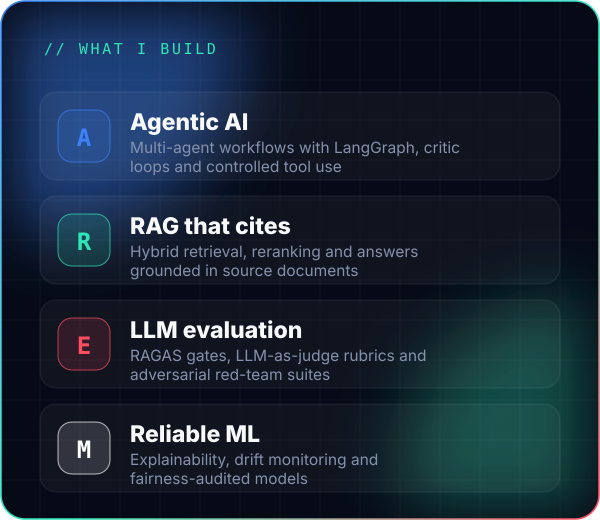
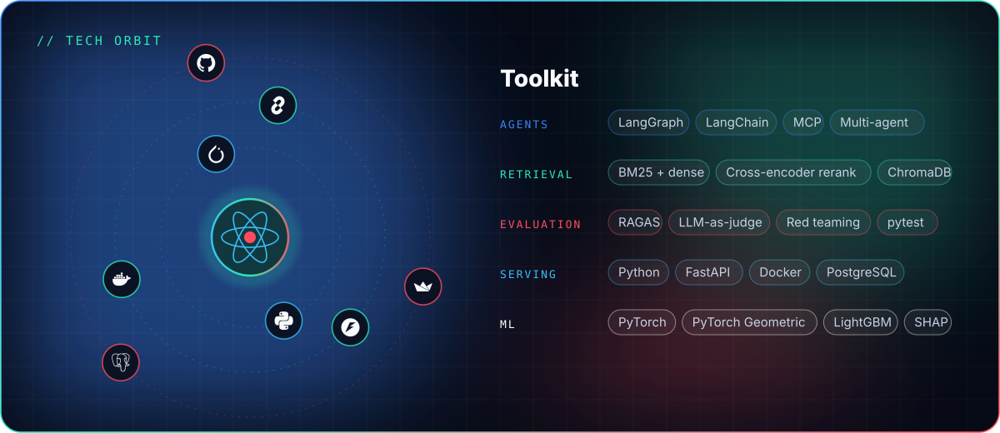
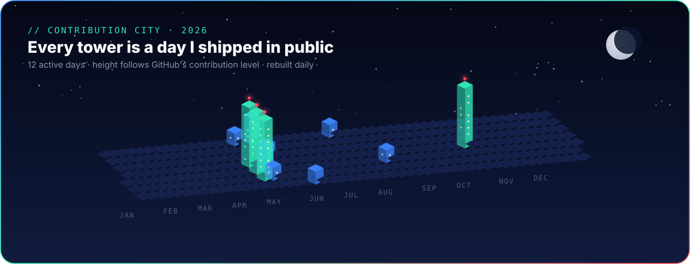

# Yaswanth Kumar Akkireddy

**AI Engineer · Generative AI · Agentic AI · Retrieval-Augmented Generation (RAG) · LLM Evaluation · AI Reliability & Security**

Applied AI Engineer at **Felix Byte Technologies** · Previously AI Red-Team Engineer at **Aram Algorithm** · Bengaluru, India  
I build agentic AI and RAG systems in **Python, LangGraph and FastAPI**, with evaluation, guardrails and audit trails designed in. Open to AI Engineering roles across India and remote.

[LinkedIn](https://www.linkedin.com/in/yaswanthakkireddy) · [GitHub](https://github.com/yaswanthakkireddy) · [Email](mailto:yaswanthkumarakkireddy@gmail.com)

## What I build

  
  

## Tech orbit

## ID badge & dashboard

## Projects

| Project | What it does | Verified result | Stack |
| --- | --- | --- | --- |
| [**CortexAgent**](https://github.com/yaswanthakkireddy/cortexagent) | Multi-agent RAG for SEC 10-K research with hybrid retrieval and critic-gated revision | 20/20 adversarial probes across 7 attack categories (project benchmark) | LangGraph · ChromaDB · RAGAS · FastAPI · MCP |
| [**MigrationLens**](https://github.com/yaswanthakkireddy/MigrationLens) | Deterministic-first MySQL-to-PostgreSQL migration risk analysis | 37/37 expected findings on the Sakila fixture · 55 rules | Python · sqlglot · PostgreSQL · SARIF |
| [**NeuroShield**](https://github.com/yaswanthakkireddy/NeuroShield) | Graph neural networks for anti-money-laundering with explanations and federated learning | GraphSAGE test PR-AUC 0.518 (temporal split) | PyTorch Geometric · FastAPI · Redis |
| [**FairLend**](https://github.com/yaswanthakkireddy/fairlend) | Explainable, fairness-audited credit scoring on HMDA 2024 data | Demographic parity ratio 0.903 (LightGBM + Fairlearn) | LightGBM · SHAP · Fairlearn |
| [**ModelWatch**](https://github.com/yaswanthakkireddy/modelwatch) | Data-drift and model-decay monitoring with a champion–challenger loop | 43 tests in CI | LightGBM · TensorFlow · Evidently AI |
| [**ExperimentOS**](https://github.com/yaswanthakkireddy/ExperimentOS) | Bayesian A/B testing with CUPED and versioned metric definitions | 30 tests in CI | PyMC · Streamlit · GitHub Actions |
| [**CarbonLedgerX**](https://github.com/yaswanthakkireddy/carbonledgerx) | Climate commitment risk intelligence: emissions forecasts and reconciled risk scores | Built on 3 public datasets (EPA eGRID, DEFRA, SBTi) | Python · FastAPI · Streamlit |

## Connect

**[LinkedIn](https://www.linkedin.com/in/yaswanthakkireddy)** · **[GitHub](https://github.com/yaswanthakkireddy)** · **[Email](mailto:yaswanthkumarakkireddy@gmail.com)**

All visuals are self-hosted SVGs; the contribution city refreshes daily through GitHub Actions.

