

# Yaswanth Kumar Akkireddy

**AI Engineer building reliable Generative & Agentic AI systems.**

Generative AI · Agentic AI · RAG · LLM Evaluation · Reliability · Security

 


Applied AI Engineer @ Felix Byte Technologies · Previously AI Red-Team Engineer @ Aram Algorithm · Bengaluru, India · Open to AI Engineering roles across India / Remote

 

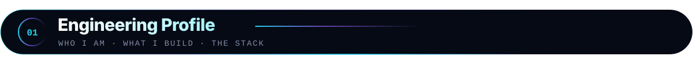


Focus: Agentic AI · Retrieval-Augmented Generation · LLM Evaluation · AI Reliability · AI Security / Red Teaming · Multi-Agent Systems — Core tools: Python · LangGraph · LangChain · FastAPI · Docker · PostgreSQL · RAGAS · PyTorch

  

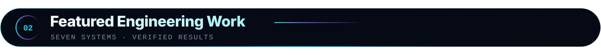

  <a href="https://github.com/yaswanthakkireddy/cortexagent">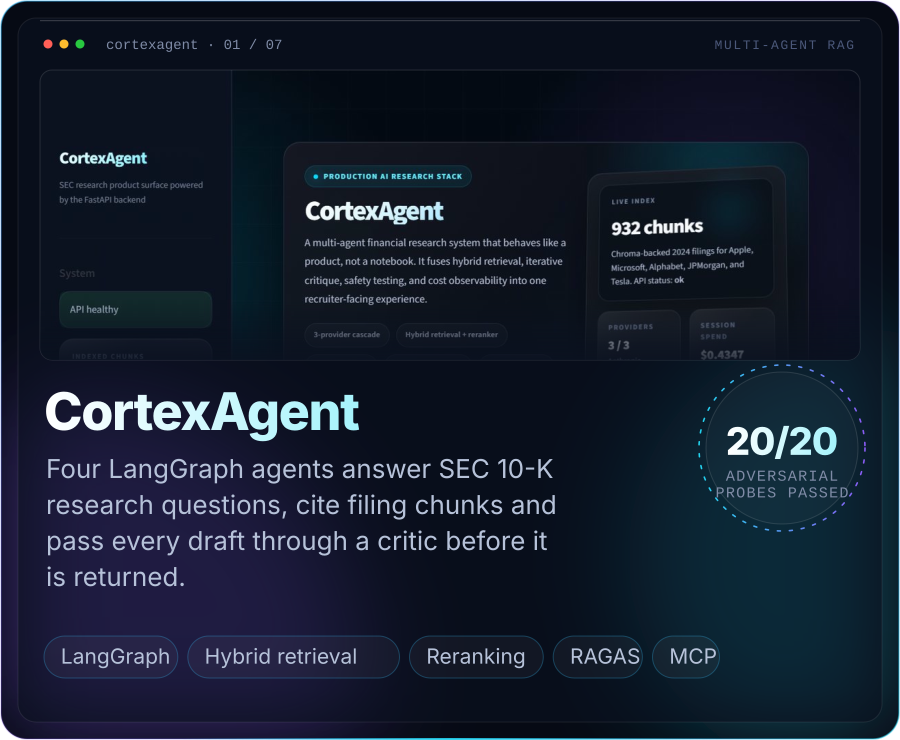</a>
  <a href="https://github.com/yaswanthakkireddy/MigrationLens">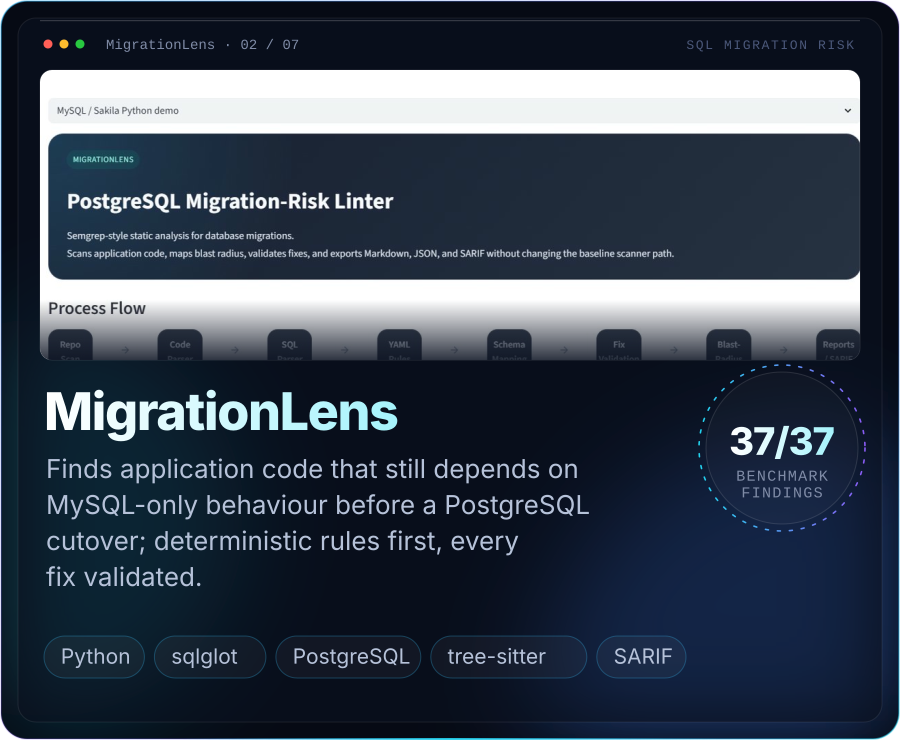</a>

<a href="https://github.com/yaswanthakkireddy/cortexagent"><b>CortexAgent</b></a> — multi-agent RAG with LangGraph, hybrid retrieval, reranking and RAGAS evaluation&nbsp;&nbsp;·&nbsp;&nbsp;<a href="https://github.com/yaswanthakkireddy/MigrationLens"><b>MigrationLens</b></a> — deterministic-first PostgreSQL migration risk analysis with sqlglot and SARIF

  <a href="https://github.com/yaswanthakkireddy/NeuroShield">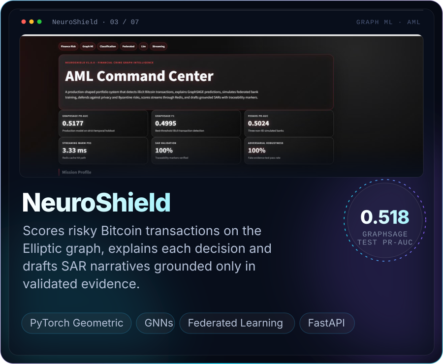</a>
  <a href="https://github.com/yaswanthakkireddy/fairlend">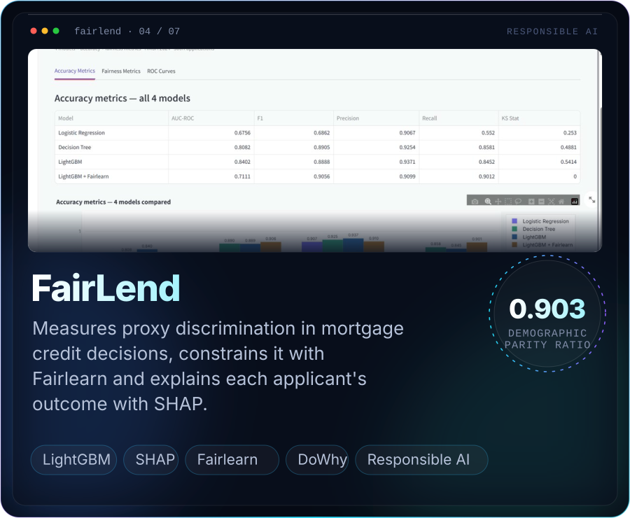</a>

<a href="https://github.com/yaswanthakkireddy/NeuroShield"><b>NeuroShield</b></a> — graph intelligence for anti-money-laundering with PyTorch Geometric and explainability&nbsp;&nbsp;·&nbsp;&nbsp;<a href="https://github.com/yaswanthakkireddy/fairlend"><b>FairLend</b></a> — explainable, fairness-audited credit scoring with SHAP and Fairlearn

  <a href="https://github.com/yaswanthakkireddy/ExperimentOS">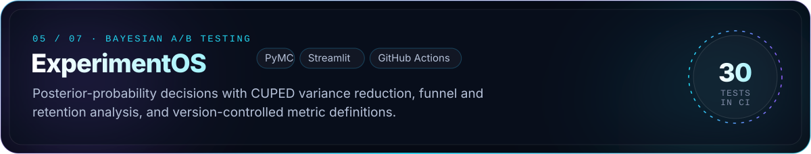</a>
  <a href="https://github.com/yaswanthakkireddy/modelwatch">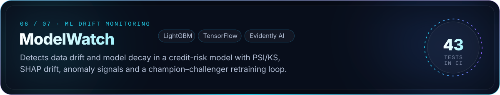</a>
  <a href="https://github.com/yaswanthakkireddy/carbonledgerx">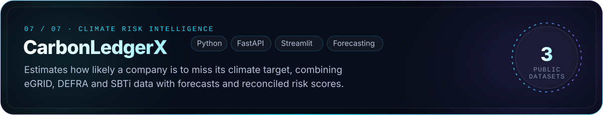</a>

 

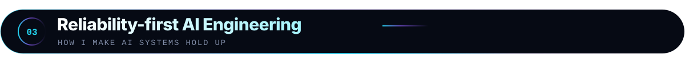

Capability is only half the system.

I care about what happens when retrieval is weak, a model hallucinates, or an agent attempts an unsafe tool action. My work combines AI engineering with structured evaluation, guardrails, auditability and adversarial testing. That focus comes from a year of red teaming LLMs for prompt injection, jailbreaks and hallucination.


- **Evaluate:** RAGAS quality gates and a red-team suite whose written contract defines what "safe" means.
- **Constrain:** deterministic checks first, with model output accepted only after validation.
- **Trace:** every agent step logged and reviewable, so failures can be found and explained.

 

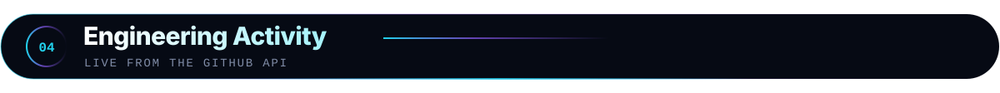

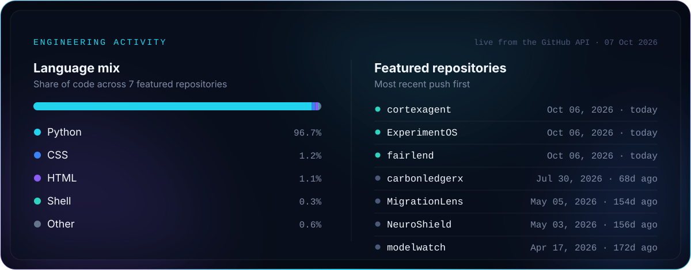

Refreshed daily by a GitHub Actions workflow in this repository. No third-party widgets.

  

  <a href="https://www.linkedin.com/in/yaswanthakkireddy"><b>LinkedIn</b></a>&nbsp;&nbsp;·&nbsp;&nbsp;
  <a href="https://github.com/yaswanthakkireddy"><b>GitHub</b></a>&nbsp;&nbsp;·&nbsp;&nbsp;
  <a href="mailto:yaswanthkumarakkireddy@gmail.com"><b>Email</b></a>

